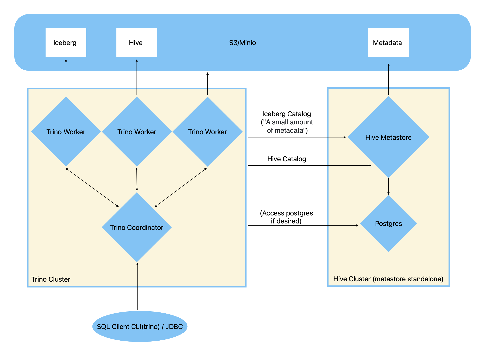

# Iceberg-trino-k8s-demo
Setting up a local [kubernetes](https://kubernetes.io) cluster on macos,
and executing distributed sql queries over [iceberg](https://iceberg.apache.org/docs/latest/) + [s3](https://aws.amazon.com/s3/)([minio](https://min.io)) via [trino](https://trino.io).

## Why
Separating the storage and processing resources allows them to be more efficiently used/scaled.

Iceberg table format scales better than hive, effectively "write once files" that support schema evolution.

Trino, more "realtime" instead of "batched" like spark, lighter weight.

Abuse the bandwidth between S3 and processing nodes.

## Technologies
[Kubernetes](https://kubernetes.io) - Container orchestration across multiple nodes.

[Minikube](https://minikube.sigs.k8s.io/docs/) - Helper to bootstrap a single node local development kubernetes cluster.

[S3](https://aws.amazon.com/s3/) - An object store. Amazons Simple Storage Service.

[Minio](https://min.io) - An object store. Self hosted. Compatible with S3 API. Used for local development in place of S3.

[Iceberg](https://iceberg.apache.org/docs/latest/) - A specification of a table format. Meaning, how to manage metadata of data files.

[Trino](https://trino.io) - A distributed query engine (cluster), similar to spark.

[Spark](https://spark.apache.org) - The de facto distributed query / data science library and engine (cluster).

## Dependencies
- [socket_vmnet](https://github.com/lima-vm/socket_vmnet) (`brew install socket_vmnet`)
- [hyperkit](https://github.com/moby/hyperkit) (`brew install hyperkit`)
- [kubectl](https://kubernetes.io/docs/reference/kubectl/) (`brew install kubernetes-cli`)
- [minikube](https://github.com/kubernetes/minikube) (`brew install minikube`)
- [trino cli](https://trino.io/docs/current/client/cli.html) (`brew install trino`)

`socket_vmnet` and `hyperkit` are used on macos to make the linux vm experience as expected (container on macos are vm within vm, needs more management/forwarding..etc)

## Summary

There are four main "deployables" organized into four namespaces.

You basically just need to `kubectl create -f <file>` them all in order. No need to add any namespace arguments, as the yamls create namespaces themselves.

Minio should be deployed before everything.

Postgres should be deployed before Hive. Hive deployment runs an init job to initialize the postgres db schema.

Hive should be deployed before Trino. Trino+Iceberg requires some metadata to be stored on a hive metastore.

As [stated on trino](https://trino.io/docs/current/connector/iceberg.html#metastores):

> The Iceberg table format manages most metadata in metadata files in the object storage itself.
A small amount of metadata, however, still requires the use of a metastore.

## Bootstrap
- `minikube start --network socket_vmnet --cpus='4' --memory='24GB' --disk-size='250GB'`
- `minikube tunnel` (leave this running to access services via clusterip via loadbalancer)
- `kubectl create -f minio.yaml`
- `kubectl get services -n minio`
- Navigate to the external ip of the minio service, on port `9090`  (http://10.100.138.239:9090/buckets)
- Login with the credentials (`admin`/`adminpassword123`)
- Create a bucket named `test`, no need to modify any other options. Note, this is the only "manual" step. We could create a job to do this using aws cli, but this serves as a good checkpoint to verify configuration.
- `kubectl create -f postgres.yaml`
- `kubectl get pods -n postgres`
- Wait for postgres to be up
- `kubectl create -f hive.yaml`
- `kubectl create -f trino.yaml`
- Trino is started with 1 coordinator and 2 workers

## Usage
### Submit Queries
- `kubectl get services -n trino`
- Take note of the external ip reported for trino
- `trino --server http://<external ip of trino>:8080 --catalog iceberg --debug`
-  You are now in a sql repl

Input `quit` or `exit` to stop and exit the trino cli.

Refer to [Trino CLI](https://trino.io/docs/current/client/cli.html), [SQL Language](https://trino.io/docs/current/language.html), [SQL Statement Syntax](https://trino.io/docs/current/sql.html)

### SQL Queries
- `quit` or `exit`
- `show schemas from iceberg;`
- `create schema iceberg.demo with (location = 's3a://test/demo');`
- `create table iceberg.demo.one(country varchar, state varchar, population bigint) with (format = 'PARQUET');`
- `show tables from demo;`
- `insert into demo.one values('usa','delaware',2000);`
- `insert into demo.one values('usa','new york',1000);`
- `select * from demo.one;`
- `delete from demo.one where state='new york';`
- `select * from demo."one$snapshots";` This `$snapshots` is accessing iceberg metadata, refer to trino iceberg connector for other iceberg metadata tables.

### Scale Workers

- `kubectl scale statefulset trino-worker -n trino --replicas=4`
- `kubectl scale statefulset trino-worker -n trino --replicas=2`

## Misc

Take a look around through the minio webui, check out the `test` bucket.

Experiment and see what the data/metadata looks like when a schema is created in  `hive` vs `iceberg`, or when the file formats are different `PARQUET/AVRO/ORC`.

Explore the trino webui!
If trino is running with `--debug` you will also get a url link to the job, like: 
> http://10.107.143.42:8080/ui/query.html?20230525_143631_00014_6xyhs

Try to scale the trino workers, and watch as the queries are distributed to them.

You are also able to access the `hive` catalog that is used by the standalone hive metastore. Trino is configured to access this same catalog.

## Useful Commands
- `watch -n 1 kubectl get services --all-namespaces`
- `watch -n 1 kubectl get pods -n trino`

## Links
- https://trino.io/docs/current/connector/iceberg.html#metadata-tables
- https://github.com/alexcpn/presto_in_kubernetes
- https://kubernetes.io/docs/reference/kubectl/cheatsheet/

## Disclaimer
Minio/s3 and postgres credentials are passed into apps using secrets and environment variables.
Hive/Trino both have configuration files that are injected into the container, these configurations have the credentials templated via environment variable.
In other words, if you need to change minio/postgres credentials, you will need to recreate the 'minio-admin' and 'postgres-admin' secrets.
There are duplicate copies of these secrets in each namespace (secrets are bound to namespaces).
A production environment would have a better secret-to-namespace management strategy.

A minio user/pass can be used as an s3 key/secret.

Iceberg has two version, V1 and V2. V2 is needed for deletion (schema evolution).
This is only supported when iceberg uses a hive metastore for the catalog, jdbc/rest will not work.

I've referenced bits and pieces to get this all hooked up together.
The repo from alexcpn was helpful for figuring out a lot of the configuration, especially the standalone hive metastore.
I've used the image built from alexcpn as it is heavily inspired by the official iceberg-spark configurations, adds some jars we need from trino/postgres.
Checking the [dockerfile](https://github.com/alexcpn/presto_in_kubernetes/blob/main/hive/Dockerfile), I wouldnt do anything different and this image is already publically available.
This image is used for the metastore, and for initializing the postgres db(via the apache schematool).